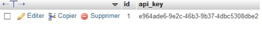

# AMT 2018 - WP1
Ludovic Delafontaine
Théo Gallandat
Joël Kaufmann
Xavier Vaz Afonso

## Introduction
We have built a [work package 1 (WP1)](https://github.com/heig-vd-amt2018/wp1) during the previous laboratory.

The current work package (WP2) is meant to allow external developpers to use a gamification system:

* WP1 was made so a developer who wants to access to the gamification system could register and manage all its applications.
* WP2 was made so a developer, using an *`API_KEY`* given in WP1, could create badges, point scales and rules for its own business logic:
  * He could create an app about monsters where everytime a player kills a monster, he get experience and could own badges for its skills.
  * He could create another app about mentorat where everytime a user helps another user, he get experience and could own badges for its contribution.
* In its applications, the developer could send events to our gaminification engine so he doesn't not need to manage that part of its application. He uses our platform as a service (PaaS).
* Everytime an event occurs for a specific application (from the *`API_KEY`* sent in the headers), the gamification engine checks the point scales, the rules and gives the badge if the threshold is achieved.

## Deployment
Follow the steps to deploy the application locally:

1. Clone the repository: `git clone git@github.com:heig-vd-amt2018/wp2.git amt-wp2`.
2. Move to the cloned directory: `cd amt-wp2/swagger/spring-server/`.
3. Compile the project: `mvn clean install`.
4. Move the compiled `.jar` to the `spring-boot` directory: `cp ./target/swagger-spring-1.0.0.jar ../../images/spring-boot/`.
5. Move the file `.env_example` to `.env` and edit the file with the right elements.
6. Deploy the application with docker: `docker-compose up --build`.
7. The gamification engine is now deployed. Developers can start to push events on `/events` but for more information, you can access:
   * the [API documentation](http://localhost:8080/api/swagger-ui.html), generated from annotations in the code.
   * the [API endpoint](http://localhost:8080/api/), accepting requests.
8. You are done ! 

## Tests with Cucumber
You can use the Cucumber project to validate the API implementation. Do this when the server is running.

```
cd amt-wp2/swagger/gamification-specs/
mvn clean test
```

You will see the test results in the console, but you can also open the file located in `./target/cucumber/index.html`

## Tests with JMeter
You can use the JMeter project to validate the server can support the load when many users use the PaaS. 

Having an API that behaves correctly when tested with Cucumber does not mean that it will do so on heavy loads. Load tests are designed to verify concurrency handling and performance limitations. 

To execute the tests you should have  [JMeter](https://jmeter.apache.org/) installed.

Tests scripts are located at `jmeter-scripts`

```
sh ./jmeter.sh path_to_jmeter_script
```

Or execute GUI with jmeter.sh without argument and open the scripts through the GUI.

In our project the mechanism that might be the most vulnerable to heavy loads is the Event handling but we will be testing a few more scenarios. Those tests are made with JMeter 5.0 that allows to perform multiple queries at the same time, chain queries and check responses.

#### Scenarios

##### Basic concurrent creations (jmeter-scripts/creations.jmx)

*Load : 100 app dev posting the same application, Ramp-Up Period : 0 s*

- Try creating application with same API key on `POST /applications` 

  - There should be only one app created with that API key

    - As GET is not implemented by our API, verification is done manually in the database
    - RESULT : PASS

    

- Try creating multiple point scales with the same name for that application on `POST /pointScales`

  - There should be only one pointScale created
    - Assertion on response JSON array size == 1 from  `GET /pointscales`
    - RESULT : FAILED, found 6
      - This shows that there is a concurrency problem for Point Scales creation

- Try creating multiple badges with the same attributes for that application on `POST /badges`

  - There should be only one badge created
    - Assertion on response JSON array size == 1 from `GET /badges` 
    - RESULT : FAILED, found 4
      - This shows that there is a concurrency problem for Badges creation

- Try creating multiple rules at the same time for that application on `POST /rules`

  - There should be only one pointScale created
    - RESULT : FAILED, found 4
      - This shows that there is a concurrency problem for Rules creation


Although this may cause errors (trying to affect an object with several), this is very unlikely to happen, since those content creations are done by the app developper. This means there is very little chance that the app developer sends 2 or more duplicated requests at the same time.


##### Events handling scenario

- Application :
  - An app is created
- PointScale : 
  - a point scale *PostsScale* is created
- Badges creation:
  - two badges are created *Rookie* and *Expert* 
- Rules creation:
  - a rule *PostingRookie* is created. It delivers the badge *Rookie* to a user on Event type *posting*
  - a rule *PostingPoints* is created. It increases the point scale *PostsScale* by 1 point on Event type *posting* 
- User creation : 
  - send an unrelated event to create a user without concurrency  (due to problems seen in the previous scenario)
- 10 users send 1000 events of type *posting* for the user at the same time


Assertions :

- the user should have exactly 1 badge : *PostingRookie*
  - assertion on BadgeRewards array size == 1
  - RESULT : FAILED, found 4
    - Concurrency problem
- he should have 10'0000 PointScale rewards
  - assertion on PointScaleRewards array size == 10000
  - RESULT : PASS

Here the concurrency problem remains, but has no effect on PointScalesRewards as all event should be processed anyway.


## Built with
This work package has been done with the following technologies:

- [Spring Boot](http://spring.io/projects/spring-boot)
- [Spring Data](http://spring.io/projects/spring-data)
- [Swagger](https://swagger.io/)
- [Cucumber](https://docs.cucumber.io/)
- [JMeter](https://jmeter.apache.org/)

## What has been done

| Description                                                  | Status |
| ------------------------------------------------------------ | ------ |
| As an application developer with an **API client**, I can perform CRUD operations on **badges**. When I ask the list of badges, I only see the badges of my application (thanks to the API key provided in the request). | Done |
| As an application developer with an **API client**, I can perform CRUD operations on **point scales**. When I ask the list of badges, I only see the badges of my application (thanks to the API key provided in the request). | Done |
| As an application developer with an **API client**, I can perform CRUD operations on **rules**. When I ask the list of badges, I only see the badges of my application (thanks to the API key provided in the request). *The simplest feature is to support stateless rules that evaluate only the event type*. | Done |
| As a gamified application, I can send a stream of application events. The correct rules are evaluated and the correct rewards are given to the user. | Done |
| As an application developer, I can define rules that evaluate more than the event type: I can write expressions that evaluate the properties attached to the event (e.g. give the badge if the event is type "askQuestion" and if event has a property "difficulty" with a value higher than 5). | Not yet |
| As an application developer, I can define rules that allow me manage some state (e.g. give the badge after 5 events of type "askQuestion") have been asked. | Not yet |
| As a **spiritual guide**, I can clone the repo, move to a documented repository and type `docker-compose up` to start the system. I also have instructions for running the automated tests. | Done |
| As a **spiritual guide**, I have complete Cucumber tests for the badges, point scales and rules endpoints. | Done |
| As a **spiritual guide**, I have advanced Cucumber tests for the /events endpoints, that validate the business logic (has the rule been triggered and are the side effects correct?) | Not yet |
| As a **spiritual guide**, I have load testing script (e.g. JMeter) that I can use to evaluate if the engine behaves correctly when several events for the same user arrive at the same time. The experiments that have been done are well documented (e.g. under which conditions did we have a bug, how did we solve it, etc.) | Not yet |
